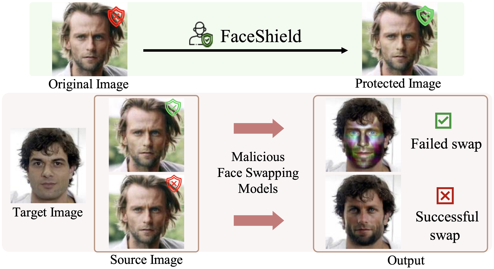
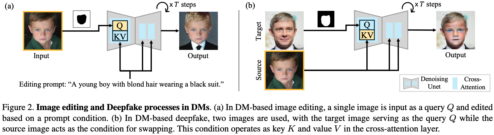
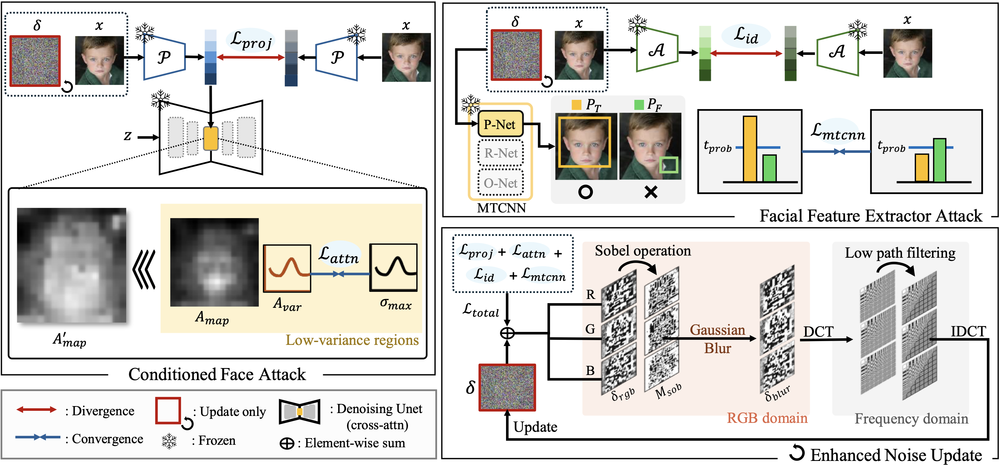

<p align="center">
  <h1 align="center"><strong>[ICCV 2025] FaceShield: Defending Facial Image<br>against Deepfake Threats</strong></h1>
</p>

<p align="center">
  Jaehwan Jeong<sup>1</sup>, Sumin In<sup>1</sup>, Sieun Kim<sup>1</sup>, Hannie Shin<sup>1</sup>,<br> 
  Jongheon Jeong<sup>1</sup>, Sang Ho Yoon<sup>2</sup>, Jaewook Chung<sup>3</sup>, Sangpil Kim<sup>1†</sup><br><br>
  <sup>1</sup>Korea University, &nbsp; <sup>2</sup>KAIST, &nbsp; <sup>3</sup>Samsung Research
</p>

<div align="center">
  <a href="https://arxiv.org/abs/2412.09921">
    
  </a>
</div>

<p align="center">
  
</p>

## **🔍 TL;DR**  
We present FaceShield, a novel and imperceptible noise injection method that protects facial images from unauthorized use by disrupting a wide range of deepfake models—including both diffusion- and GAN-based approaches. It achieves state-of-the-art robustness, high imperceptibility, and strong transferability across datasets.
<p align="center">
  
</p>

## **⚙️ Installation**  
Tested on Ubuntu 22.04 + CUDA 12.4 + Python 3.8 (RTX A6000)  

```bash
git clone https://github.com/kuai-lab/iccv25_faceshield.git
cd iccv25_faceshield
conda env create -f environment.yaml
conda activate faceshield
```

## 📂 **Model Setup**
To prepare the pre-trained weights for inference, follow these steps:

> **Note**: All pretrained weights used here are from publicly available sources.  
> We only reorganized them to match the codebase structure, without modifying the original weights.

1. Download the ArcFace pre-trained weights from [ArcFace Pretrained Weights link](https://drive.google.com/drive/folders/1lmKkNUsoebszm3W5xhnw1ybKVwozMYwO?usp=drive_link).

2. Extract the downloaded ArcFace and place it in the `./models` directory. Your directory structure should look like this:
    ```swift
    iccv25_faceshield/
    ├── models/
    │   ├── arcface50_checkpoint.tar/
    │   ├── arcface100_checkpoint.tar/
    │   ├── arcface_models.py/
    │   ├── config.py/
    ├── attack.py/
    ├── ddpwrapper.py
    └── ...
    ```

## **🛡️ Run the Protection**

<p align="center">
  
</p>

🛠️ `run.sh`: FaceShield Noise Injection Configuration

To run the protective noise generation with default settings, execute:

```bash
sh run.sh
```

You can customize the behavior by editing the variables inside run.sh as shown below:
```bash
# run.sh

image_path="data/test"           # Input image folder path
save_path="results"              # Directory where results will be saved
resize_shape=512                 # Resize input image to (512, 512)

proj_func="l1"                   # Projection loss type (e.g., l1, l2)
attn_func="l2"                   # Attention loss type (e.g., l1, l2)
attn_threshold=0.2               # Threshold for attention masking
arc_func="cosine"                # ArcFace loss type (e.g., cosine, l2)

total_iter=30                    # PGD total iterations
noise_clamp=12                   # Max allowed noise (L∞ norm)
step_size=1                      # Step size for each PGD iteration

# Execute attack with specified parameters
sh execute.sh $save_path $resize_shape $proj_func $attn_func $attn_threshold \
              $arc_func $total_iter $noise_clamp $step_size $image_path
```


## **📜 Citation**  
```tex
@article{jeong2024faceshield,
  title={FaceShield: Defending Facial Image against Deepfake Threats},
  author={Jeong, Jaehwan and In, Sumin and Kim, Sieun and Shin, Hannie and Jeong, Jongheon and Yoon, Sang Ho and Chung, Jaewook and Kim, Sangpil},
  journal={arXiv preprint arXiv:2412.09921},
  year={2024}
}
```

## Acknowledgement

Our code is based on these wonderful repos:

* [Stable Diffusion](https://github.com/CompVis/latent-diffusion?tab=readme-ov-file)
* [CLIP](https://github.com/openai/CLIP)
* [MTCNN](https://github.com/ipazc/mtcnn)
* [ArcFace](https://github.com/deepinsight/insightface)